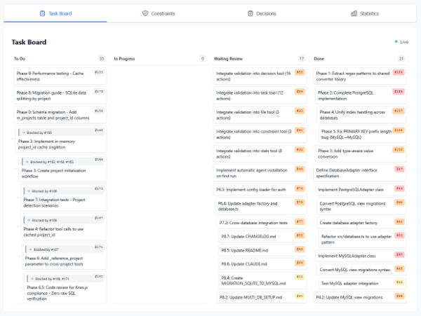

# sqlew


[](https://www.npmjs.com/package/sqlew)
[](https://www.gnu.org/licenses/agpl-3.0)

> **SQL Efficient Workflow** - MCP server Provides consistency and token savings for AI coding 

## What is sqlew?

**sqlew** is a Model Context Protocol (MCP) server that gives AI agents organizational memory across sessions.

### Concerns About AI Coding
Every Claude session starts with zero context. You must re-explain decisions, agents can reintroduce bugs, and there's no way to track WHY decisions were made.

It is possible to keep records using Markdown files.
However, maintaining records for large-scale projects and long-term maintenance generates an enormous volume of documentation.

This has become problematic because it causes context rotting in AI systems, leading to performance deterioration.

### *sqlew* provides the solution for this problem
sqlew builds efficient external memory for AI by using relational databases.
- Records the reasoning behind decisions
- Enables querying past context
- Prevents anti-patterns through constraints
- Eliminates duplicate work via task management

> *This software does not send any data to external networks. We NEVER collect any data or usage statistics. Please use it with complete security.*

## Why Use sqlew?

### 🧠 Organizational Memory
Traditional code analysis like git tells you **WHAT** is done, sqlew adds **WHY** and **HOW** on it:
- **Decisions** → WHY it was changed
- **Constraints** → HOW should it be written
- **Tasks** → WHAT needs to be done

### ⚡ Token Efficiency
**60-75% token reduction** in multi-session projects through structured data storage and selective querying.

### 🎯 Key Benefits for Your Development Workflow

#### 🧠 **Context Persistence Across Sessions**
- **No More Re-Explaining**: AI remembers decisions from weeks ago - no need to re-explain "why we chose PostgreSQL over MongoDB"
- **Session Continuity**: Pick up exactly where you left off, even after days or weeks
- **Team Knowledge Sharing**: New team members (or new AI sessions) instantly understand past decisions

#### 🛡️ **Prevents Context Rotting & Inconsistency**
- **Architectural Constraints**: Define rules once ("always use async/await, never callbacks"), AI follows them forever
- **Version History**: Track how decisions evolved - see what changed and when

#### 🎯 **Enables Consistent, High-Quality Code**
- **Bug Prevention**: AI won't reintroduce bugs you already fixed (decisions document "what didn't work")
- **Pattern Enforcement**: Constraints ensure AI writes code matching your team's style
- **Context-Aware Suggestions**: AI sees related decisions before creating new ones ("Did you know we already solved this?")
- **Rationale Documentation**: Every decision includes WHY it was made, preventing cargo-cult programming

#### 📊 **Transparent AI Work Tracking**
- **Task Dependencies**: AI knows Task B needs Task A completed first
- **Auto File Watching**: Tasks auto-update when AI edits tracked files (zero manual updates)
- **Progress Visibility**: See exactly what AI is working on, what's blocked, what's done

#### ⚡ **Efficiency & Reliability**
- **60-75% Token Reduction**: Structured data beats dumping entire context into prompts
- **Reduce Context Rot**: No more "this README is 50 pages and AI ignores half of it"
- **Production-Ready**: 495/495 tests passing (100%), battle-tested on real projects

---

**Technical Features**: 6 specialized MCP tools (decisions, tasks, files, constraints, stats, suggest), smart similarity scoring (0-100 point algorithm), runtime reconnection, parameter validation, metadata-driven organization

See [docs/TASK_OVERVIEW.md](docs/TASK_OVERVIEW.md) and [docs/DECISION_CONTEXT.md](docs/DECISION_CONTEXT.md) for details.

### 🔖Kanban-style AI Scrum


(This visualizer is not included in this package)

## Installation

### Requirements
- Node.js 18.0.0 or higher
- npm or npx

### Quick Install

on `.mcp.json` in your project's root, add these lines:

```json
{
  "mcpServers": {
    "sqlew": {
      "command": "npx",
      "args": ["sqlew"]
    }
  }
}
```
**Recommend to restart claude after initialize**

The first time, sqlew initializes database, installs custom agents and slash commands. But agents and commands are not loaded in this time. So, please exit claude once, and restart claude again.

It's Ready!

## 🚀 Quick Start: Slash Commands (Recommended)

**Slash commands are the easiest way to use sqlew!** Just type `/sqw-` in Claude Code to see available commands.

### Most Common Commands

```bash
# Plan a new feature (architecture + tasks)
/sqw-plan "Implement user authentication"

# Record a decision (like meeting minutes)
/sqw-secretary "Use PostgreSQL 15 for production database"

# Implement a feature (creates tasks AND coordinates agents to build it!)
/sqw-scrum implement JWT authentication

# Search past decisions
/sqw-research "Why did we choose Knex for migrations?"
```

**All 6 commands** are installed automatically on first run. See [Slash Commands](#slash-commands) section below for complete guide.

---

**⚠️Note**: Global install (`npm install -g`) is **not recommended** because sqlew requires an independent settings per project. Each project should maintain its own context database in `.sqlew/sqlew.db`.

**Custom database path:** Add path as argument: `"args": ["sqlew", "/path/to/db.db"]`
**Default location:** `.sqlew/sqlew.db`

**⚠️ Not Supported:** Junie AI cannot use relative paths in MCP server configurations, which makes it incompatible with sqlew's project-based database model. Each project requires its own isolated database at `.sqlew/sqlew.db`, but Junie AI's global MCP configuration cannot handle per-project database paths.

## Configuration

### Database Support

sqlew supports multiple database backends for different deployment scenarios:

| Database | Use Case                                     | Status      |
|----------|----------------------------------------------|-------------|
| **SQLite** | Personal or small projects                   | ✅ Default   |
| **MySQL 8.0 / MariaDB 10+** | Production, shared environments, remote work | ✅ Supported |
| **PostgreSQL 12+** | Production, shared environments, remote work | ✅ Supported |

Of course, it also works with Docker RDB instances.

### Optional Config File

On first run, `.sqlew/config.toml` will be created for persistent settings:

**SQLite (Default):**
```toml
[database]
path = ".sqlew/custom.db"

[autodelete]
ignore_weekend = true
message_hours = 48
```

**PostgreSQL:**
```toml
[database]
type = "postgres"

[database.connection]
host = "localhost"
port = 5432
database = "sqlew_db"

[database.auth]
type = "direct"
user = "sqlew_user"
password = "secret"
```

**MySQL/MariaDB:**
```toml
[database]
type = "mysql"

[database.connection]
host = "localhost"
port = 3306
database = "sqlew_db"

[database.auth]
type = "direct"
user = "sqlew_user"
password = "secret"
```

Also `.sqlew/config.example.toml` is created for reference.

**Settings Priority:** CLI args > config.toml > database defaults

See [docs/CONFIGURATION.md](docs/CONFIGURATION.md) for all options and validation rules.

### CLI Configuration (Recommended)

Configuration is managed via **`.sqlew/config.toml`** file and **CLI arguments only**. The MCP `config` tool has been removed for simplicity.

**Why CLI-only configuration?**
- **No drift:** Single source of truth (config file)
- **Version control:** Commit config to git, share with team
- **Clear documentation:** Config file documents project requirements
- **Type safety:** TOML validation catches errors at startup

**Common CLI arguments:**
```bash
# Custom database path
npx sqlew /path/to/database.db

# Auto-deletion settings
npx sqlew --autodelete-message-hours=48
npx sqlew --autodelete-file-history-days=30
npx sqlew --autodelete-ignore-weekend

# Custom config file
npx sqlew --config-path=.sqlew/custom.toml
```

For persistent settings, edit `.sqlew/config.toml` instead of using CLI arguments.

## Quick Start

install it, launch claude, exit claude and launch Claude again.

### Basic Usage

You'll never need to call it manually, I recommend to call this tool via prompt.

```
read sqlew usecases, and plan implementation of feature X using sqlew.
```

or invoke Specialized Agent

```
/sqw-plan implementation of feature X .
```

Specialized Agents use sqlew more efficiently.

## Specialized Agents

sqlew provides three specialized agents for efficient multi-agent coordination in Claude Code:

| Agent | Purpose | Token Cost | Use When |
|-------|---------|------------|----------|
| **Scrum Master** | Multi-agent coordination, task management, sprint planning | 12KB/conversation | Coordinating complex features, managing dependencies, tracking progress |
| **Researcher** | Query decisions, analyze patterns, investigate context | 14KB/conversation | Understanding past decisions, onboarding new members, sprint retrospectives |
| **Architect** | Document decisions, enforce constraints, maintain standards | 20KB/conversation | Making architectural choices, establishing rules, validating compliance |

### Detailed Installation

**By default, all three specialized agents are automatically installed** to your project's `.claude/agents/` directory on first run.

To disable specific agents, create `.sqlew/config.toml`:

```toml
[agents]
scrum_master = true   # Coordination specialist (12KB)
researcher = false    # Disable this agent
architect = true      # Documentation specialist (20KB)
```

**Note**: Set an agent to `false` in the config file to prevent it from being installed.

**Usage**: Invoke agents with the `@` prefix: `@sqlew-scrum-master`, `@sqlew-researcher`, `@sqlew-architect`

**Recommendation**: Use all three agents together - they're complementary specialists (46KB total).

**Token Optimization** (if needed): Disable unused agents in config.
Savings: Scrum + Architect = 32KB (30%) | Scrum only = 12KB (74%)

**See [docs/SPECIALIZED_AGENTS.md](docs/SPECIALIZED_AGENTS.md) for complete installation guide, usage examples, and customization.**

## Slash Commands

**🎯 Recommended for Human Users** - Slash commands provide guided workflows that are easier than raw MCP tool calls.

Installed automatically to `.claude/commands/` on server startup. Just type `/sqw-` in Claude Code to get started!

### Available Commands

| Command | What It Does | Perfect For |
|---------|--------------|-------------|
| **`/sqw-plan`** | Complete feature planning (architecture + tasks) | Starting new features, planning sprints |
| **`/sqw-secretary`** | Record decisions like meeting minutes | Documenting team decisions, capturing context |
| **`/sqw-scrum`** | Create tasks AND coordinate agents to implement them | Actually building features end-to-end |
| **`/sqw-documentor`** | Document architectural decisions with full context | Design reviews, architecture documentation |
| **`/sqw-research`** | Search past decisions and analyze patterns | Onboarding, understanding past choices |
| **`/sqw-review`** | Validate code/design against decisions & constraints | Code reviews, ensuring consistency |

### Why Use Slash Commands?

✅ **Guided workflows** - Commands prompt you through the process
✅ **Agent coordination** - Automatically invokes the right agents
✅ **Error handling** - Built-in validation and helpful error messages
✅ **Mode detection** - `/sqw-scrum plan` manages tasks, `/sqw-scrum implement` builds code
✅ **No MCP knowledge needed** - Just describe what you want in plain English

### Quick Examples

```bash
# Starting a new feature
/sqw-plan Add OAuth2 social login with Google and GitHub
# → Architect documents decisions, Scrum creates tasks

# Recording a decision from today's meeting
/sqw-secretary Team decided to use PostgreSQL 15 for production
# → Saves with context, checks for duplicates

# Actually implementing a feature (game changer!)
/sqw-scrum implement JWT authentication
# → Creates tasks, coordinates agents, writes code, runs tests

# Finding out why something was done
/sqw-research Why did we choose Knex over Prisma?
# → Searches decisions, shows rationale and tradeoffs
```

### Configuration

All commands install by default. Customize in `.sqlew/config.toml`:

```toml
[commands]
plan = true        # Feature planning
secretary = true   # Record decisions
scrum = true       # Task management + execution
documentor = true  # Architecture docs
research = true    # Search history
review = true      # Code/design validation
```

**📚 Complete Guide**: [docs/SLASH_COMMANDS.md](docs/SLASH_COMMANDS.md) - Usage patterns, customization, examples

### Advanced: Direct MCP Tool Access

Power users can still call MCP tools directly. See [Available Tools](#available-tools) section below.

### Available Tools

| Tool | Purpose | Example Use |
|------|---------|------------|
| **decision** | Record choices and reasons | "We chose PostgreSQL" |
| **constraint** | Define rules | "DO NOT use raw SQL, use ORM" |
| **task** | Track work | "Implement feature X" |
| **file** | Track changes | "Modified auth.ts" |
| **stats** | Database metrics | Get layer summary |
| **suggest** | Find similar decisions (v3.9.0) | Duplicate detection, pattern search |


## Documentation

Each tool supports `action: "help"` for full documentation and `action: "example"` for comprehensive usage examples.

And `action: "use_case"` shows how to use the tool in a real-world scenario.

### On-Demand Documentation

All tools support:
- `action: "help"` - Parameter reference and descriptions
- `action: "example"` - Usage scenarios and examples
- `action: "use_case"` - Real-world usage examples

### For AI Agents

**Essential Guides:**
- [Tool Selection](docs/TOOL_SELECTION.md) - Decision tree, when to use each tool
- [Workflows](docs/WORKFLOWS.md) - Multi-step examples, multi-agent coordination
- [Tool Reference](docs/TOOL_REFERENCE.md) - Parameters, batch operations, templates
- [Best Practices](docs/BEST_PRACTICES.md) - Common errors, troubleshooting

**Task System:**
- [Task Overview](docs/TASK_OVERVIEW.md) - Lifecycle, status transitions
- [Task Actions](docs/TASK_ACTIONS.md) - All actions with examples
- [Task Dependencies](docs/TASK_DEPENDENCIES.md) - Blocking relationships
- [Task Linking](docs/TASK_LINKING.md) - Link to decisions/constraints/files
- [Task Migration](docs/TASK_MIGRATION.md) - Migrate from decision-based tracking

**Advanced Features:**
- [Decision Intelligence](docs/DECISION_INTELLIGENCE.md) - Three-tier duplicate detection (v3.9.0)
- [Decision Context](docs/DECISION_CONTEXT.md) - Rich decision documentation
- [Auto File Tracking](docs/AUTO_FILE_TRACKING.md) - Zero-token task management
- [Acceptance Criteria](docs/ACCEPTANCE_CRITERIA.md) - All check types

**Reference:**
- [Shared Concepts](docs/SHARED_CONCEPTS.md) - Layer definitions, enum values
- [Configuration](docs/CONFIGURATION.md) - Config file setup, all options
- [Architecture](docs/ARCHITECTURE.md) - Technical architecture

### Advanced Usage

- [Configuration Guide](docs/CONFIGURATION.md) - TOML config file setup
- [CLI Mode Overview](docs/cli/README.md) - Database migration, export/import commands
- [Building from Source](docs/ARCHITECTURE.md#development) - Setup instructions
- [Migration Guides](docs/MIGRATION_v2.md) - Version upgrade guides

## Use Cases

- **Multi-Agent Coordination**: Orchestrators create tasks, agents send status updates
- **Breaking Change Management**: Record deprecations and add architectural constraints
- **Decision Context**: Document rationale, alternatives considered, and trade-offs
- **Session Continuity**: Save progress in Session 1, resume in Session 2

See [docs/WORKFLOWS.md](docs/WORKFLOWS.md) for detailed multi-step examples.

## Performance

- **Query speed**: 2-50ms
- **Concurrent agents**: 5+ simultaneous
- **Storage efficiency**: ~140 bytes per decision
- **Token savings**: 60-75% in typical projects

## Support

Support development via [GitHub Sponsors](https://github.com/sponsors/sin5ddd) - One-time or monthly options available.

## Version

Current version: **3.9.0**
See [CHANGELOG.md](CHANGELOG.md) for release history.

**What's New in v3.9.0:**
- **Decision Intelligence System** - Three-tier duplicate detection (35-44 gentle nudge, 45-59 hard block, 60+ auto-update)
- **New `suggest` Tool** - Find similar decisions by key, tags, or context
- **Policy-Based Auto-Triggering** - Automatic suggestions when `suggest_similar=1`
- **Enhanced Metadata** - Auto-update responses include `duplicate_reason`, `version_info`, `update_command`

See [docs/DECISION_INTELLIGENCE.md](docs/DECISION_INTELLIGENCE.md) for details.

## License

AGPLv3 - Free to use. Open-source required when embedding or modifying. See [LICENSE](LICENSE) for details.

## Links

- [npm package](https://www.npmjs.com/package/sqlew)
- [GitHub repository](https://github.com/sin5ddd/mcp-sqlew)
- [Model Context Protocol](https://modelcontextprotocol.io/)

## Support & Documentation

- Issues: [GitHub Issues](https://github.com/sin5ddd/mcp-sqlew/issues)
- Docs: [docs/](docs/) directory

## Acknowledgments

Built with [Model Context Protocol SDK](https://github.com/modelcontextprotocol/sdk), [better-sqlite3](https://github.com/WiseLibs/better-sqlite3), and TypeScript.

**Author**: sin5ddd
