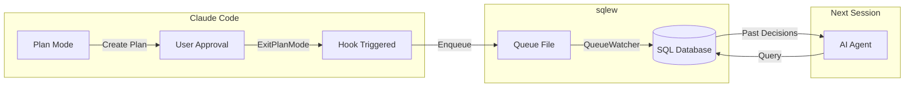
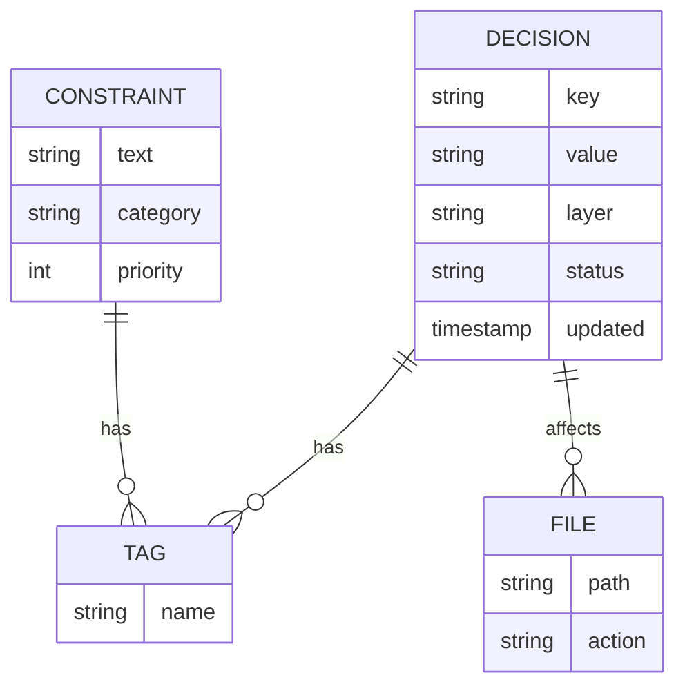

# ADR (Architecture Decision Record) Concepts

**Architecture Decision Records (ADR)** document the architectural decisions made on a project, including context, consequences, and alternatives considered. sqlew extends this proven pattern to AI agents.

## How It Works

**Zero-effort knowledge accumulation:**
1. You plan your work normally in Claude Code
2. Hooks automatically capture decisions
3. Next session, AI queries past decisions via SQL

## Core ADR Concepts in sqlew

**Decisions** capture architectural choices with full context:
- **What** was decided (the decision itself)
- **Why** it was chosen (rationale, trade-offs)
- **What else** was considered (alternatives rejected)
- **Impact** on the system (consequences, affected components)

**Constraints** define architectural principles and rules:
- **Performance requirements** (response time limits, throughput goals)
- **Technology choices** ("must use PostgreSQL", "avoid microservices")
- **Coding standards** ("async/await only", "no any types")
- **Security policies** (authentication patterns, data handling rules)

**Implementation tracking** connects decisions to reality:
- **File tracking** shows which code was affected by decisions
- **Status evolution** tracks decision lifecycle (draft → active → deprecated)
- **Auto-capture via Hooks** records decisions automatically from Plan Mode

## Why SQL for ADR?

Traditional text-based ADR forces AI to:
- Read complete files even for simple queries
- Parse unstructured text to find relationships
- Manually detect duplicate or conflicting decisions

sqlew's **SQL-backed ADR repository** enables AI to:
- Query by layer, tags, status in milliseconds (2-50ms)
- Join decisions with constraints and files
- Leverage similarity algorithms to prevent duplicates
- Scale to thousands of decisions without context explosion

**Token efficiency**: 60-75% reduction compared to reading Markdown ADRs

## Why RDBMS + MCP for ADR?

**RDBMS (Relational Database)** provides efficient structured queries:
- **Indexed searches** – Find decisions by tags/layers in milliseconds, not seconds
- **JOIN operations** – Query related decisions and constraints in a single operation
- **Transaction support** – ACID guarantees ensure data integrity across concurrent AI agents
- **Scalability** – Handle thousands of ADRs without performance degradation

**MCP (Model Context Protocol)** enables seamless AI integration:
- **Direct tool access** – AI agents call ADR operations as native functions
- **Token efficiency** – Retrieve only required data, avoiding full-file reads
- **Type safety** – Structured parameters prevent errors and guide correct usage
- **Cross-session persistence** – ADRs survive beyond individual chat sessions

**Together**: AI agents gain SQL-powered ADR capabilities without managing databases directly.

## Traditional vs sqlew ADR

| Traditional ADR (Markdown) | sqlew ADR (SQL) |
|---------------------------|-----------------|
| Read entire files | Query specific decisions |
| Manual duplicate checking | Automatic similarity detection |
| Text parsing required | Structured, typed data |
| Linear token scaling | Constant-time lookups |
| File-based organization | Relational queries with JOINs |

## Key Benefits for AI-Driven Development

### 📚 Persistent Architectural Memory
- **Zero context loss** – AI agents remember every architectural decision across sessions
- **Rationale preservation** – Never forget WHY a decision was made, not just WHAT
- **Alternative tracking** – Document rejected options to prevent circular debates
- **Evolution history** – See how decisions changed over time with full version history

### 🛡️ Prevent Architectural Drift
- **Constraint enforcement** – Define architectural rules once, AI follows them forever
- **Pattern consistency** – AI generates code matching established patterns automatically
- **Anti-pattern prevention** – Document "what NOT to do" as enforceable constraints
- **Regression prevention** – AI won't reintroduce previously rejected approaches

### 🔍 Intelligent Decision Discovery
- **Three-tier duplicate detection** – Gentle nudge (35-44), hard block (45-59), or auto-update (60+) based on similarity score
- **Similarity detection** – AI identifies duplicate or related decisions before creating new ones
- **Context-aware search** – Query by layer, tags, or relationships to find relevant decisions
- **Impact analysis** – Trace which files are affected by each decision
- **Conflict detection** – Find decisions that contradict or supersede each other

### ⚡ Extreme Efficiency
- **60-75% token reduction** – Query only relevant decisions instead of reading all ADRs
- **Millisecond queries** – 2-50ms response times even with thousands of decisions
- **Scalable architecture** – Perform well with large decision histories
